# Visual Diagnostics for More Informed Machine Learning

> How could they see anything but the shadows if they were never allowed to move their heads?
>
> &mdash; <cite> Plato [_The Allegory of the Cave_](http://classics.mit.edu/Plato/republic.8.vii.html)</cite>


## Introduction
Python and high level libraries like Scikit-learn, TensorFlow, NLTK, PyBrain, Theano, and MLPY have made machine learning accessible to a broad programming community that might never have found it otherwise. With the democratization of these tools, there is now a large, and growing, population of machine learning practitioners who are primarily self-taught. At the same time, the stakes of machine learning have never been higher; predictive tools are driving decision-making in every sector, from business, art, and engineering to education, law, and defense.

How do we ensure our predictions are valid and robust in a time when these few lines of Python...

```python
from sklearn.linear_model import LinearRegression
model = LogisticRegression()
model.fit(X,y)
model.predict(X)
```

...can instantiate and fit a model? How do you build intuition around what initial model to select? Which features do you use? Which should you normalize? How do you identify problems like local minima and overfit?

To help us think through these questions, let's take a look at the following four datasets, imagining that we want to produce predictive models for each set:    

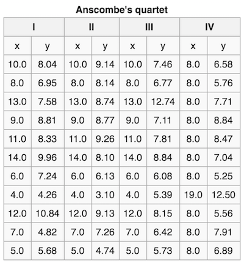

What kind of model should we use to fit the data? Let's compute some statistical properties for each of the datasets: the mean and variance for x and for y, the correlation coefficient for (x,y) and the slope and intercept of their linear regression. Here's what we get for all four datasets:

| Property               | Value                           |  
| ---------------------- | --------------------------------|    
| mean(x)                | 9                               |    
| variance(x)            | 11                              |    
| mean(y)                | 7.50                            |    
| variance(y)            | ~4.125                          |    
| np.corrcoef(x,y)       | 0.816                           |    
| stats.linregress(x,y)  | slope = 0.5, intercept = 3.00   |    


In other words, from a statistical standpoint, they're nearly identical. This might lead us to decide to use a single model for each, maybe `sklearn.linear_model.LinearRegression`? And yet, if we were to plot the points for each of the datasets, we would see that they are not at all alike:    
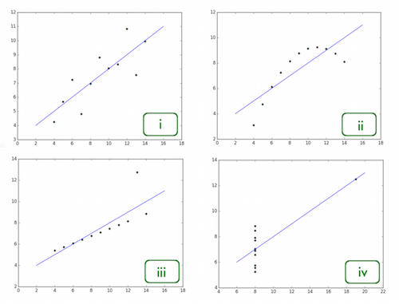   

More importantly, a simple linear regression model is not going to perform equally well on each. While we can see a linear relationship in (_x1_,_y1_) and (_x3_,_y3_), their regression lines are substantially different. In the (_x2_,_y2_) plot, we can see that the variables are related but not linearly correlated, and also that they are not normally distributed. Moreover, both the (_x3_,_y3_) and the (_x4_,_y4_) datasets contain outliers big enough to strongly influence the correlation coefficients.

Assembled by English statistician Frank Anscombe in 1973, the takeaway from these four datasets, known as [Anscombe's Quartet](https://en.wikipedia.org/wiki/Anscombe%27s_quartet), and their corresponding visualizations is that of all of the analytical tools at our disposal, sometimes our eyes are the most important. In data science, visual diagnostics are a powerful but frequently underestimated tool. Visualizations don't have to be the end of the pipeline. They can allow us to find patterns we simply cannot see by looking at raw data alone. Where static outputs and tabular data may render patterns opaque, human visual analysis can uncover volumes and lead to more robust programming and better data products. In machine learning, where lots of things can cause trouble (messy data, overtraining, undertuning, the curse of dimensionality, etc.) visual diagnostics can mean the difference between a model that crashes and burns, and one that predicts the future. In this post, I'd like to show how visualization tools can offer analytical support at several key stages in the machine learning process. I'll demonstrate how to deploy some of the visualization tools from the standard Scikit-Learn and MatPlotLib libraries (along with a few special tricks from Pandas, Bokeh, and Seaborn) and illustrate how visual diagnostics can support the "model selection triple": doing feature analysis, choosing a model, and tuning its parameters.


### A Range of Datasets  
In order to explore these visualization methods in several different contexts, we'll be using a few different datasets from the [UCI Machine Learning Repository](http://archive.ics.uci.edu/ml/):

1. [Detecting Room Occupancy](http://archive.ics.uci.edu/ml/datasets/Occupancy+Detection+) from light, humidity, CO2, etc.    
2. [Predicting Default in Credit Card Clients](http://archive.ics.uci.edu/ml/datasets/default+of+credit+card+clients) from sex, education, marital status, age, and payment history.     
3. [Predicting Concrete Compressive Strength](http://archive.ics.uci.edu/ml/datasets/Concrete+Compressive+Strength) from its age and ingredients.   

Here is a simple function that uses the Python `requests` module to go to the UCI page to fetch all three:

```python
import os
import zipfile
import requests

OCCUPANCY = "http://archive.ics.uci.edu/ml/machine-learning-databases/00357/occupancy_data.zip"
CREDIT    = "http://archive.ics.uci.edu/ml/machine-learning-databases/00350/default%20of%20credit%20card%20clients.xls"
CONCRETE  = "http://archive.ics.uci.edu/ml/machine-learning-databases/concrete/compressive/Concrete_Data.xls"

def download_data(url, path='data'):
    if not os.path.exists(path):
        os.mkdir(path)

    response = requests.get(url)
    name = os.path.basename(url)
    with open(os.path.join(path, name), 'w') as f:
        f.write(response.content)

download_data(OCCUPANCY)
download_data(CREDIT)
download_data(CONCRETE)

z = zipfile.ZipFile(os.path.join('data', 'occupancy_data.zip'))
z.extractall(os.path.join('data', 'occupancy_data'))
```


## More Intuitive Feature Analysis and Selection
_Features analysis is hard. Visualizations can help._    

Feature selection is key to successful machine learning. Here the objective is to find the smallest set of the available features such that the fitted model will reach it's maximal predictive value. Statistical measures like averages and variance are a very useful first step to unpacking the features. Now that we've got our data, let's import `pandas`, load each into a data frame and take a quick look:

```python
import pandas as pd

occupancy   = pd.read_csv(os.path.join('data','occupancy_data','datatraining.txt'), sep=",")
occupancy.columns = ['date', 'temp', 'humid', 'light', 'co2', 'hratio', 'occupied']
print occupancy.head()
print occupancy.describe()

credit      = pd.read_excel(os.path.join('data','default%20of%20credit%20card%20clients.xls'), header=1)
credit.columns = ['id','limit','sex','edu','married','age','apr_delay','may_delay','jun_delay','jul_delay',\
                  'aug_delay','sep_delay','apr_bill','may_bill','jun_bill','jul_bill','aug_bill','sep_bill',\
                  'apr_pay','may_pay','jun_pay','jul_pay','aug_pay','sep_pay','default']
print credit.head()
print credit.describe()

concrete   = pd.read_excel(os.path.join('data','Concrete_Data.xlsx'))
concrete.columns = ['cement', 'slag', 'ash', 'water', 'superplast', 'coarse', 'fine','age','strength']
print concrete.head()
print concrete.describe()
```

We can start to get a feel for the differences across our three datasets from the output of the `.describe()` statements above. For example, in the occupancy dataset, the standard deviations for light and CO2 emissions are two orders of magnitude greater than they are for temperature and humidity, meaning that some scaling may be necessary. In the credit card default dataset, the distribution of the labels (0 for credit card holders who did not default on the payment and 1 for those who did) appears uneven, which can be an indicator of possible class imbalance.  But, if you had to select which features were most likely to be predictive based solely on the descriptive tables, it would be pretty tough, especially without domain expertise (what the heck is superplasticity?). At this point, those who have some experience with predictive modeling will often begin to visualize the data so that they can see the behavior of the different feature vectors.

### Boxplots
Boxplots (or 'box-and-whisker' plots) enable us to look at the central tendency of the data, see the distribution, and examine outliers. In the example below, each feature of the concrete dataset is listed out on the x-axis and for each feature, we get to visualize the data's behavior. The boxes indicate the upper and lower quartiles of the data, the black line in the center of each box indicates the median, the whiskers show the biggest and smallest values (with the outliers excluded), and the diamonds show the outliers.

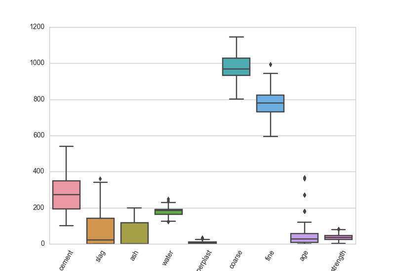   

```python
import seaborn as sns
import matplotlib.pyplot as plt

sns.set_style("whitegrid")

def box_viz(df):
    ax = sns.boxplot(df)
    plt.xticks(rotation=60)
    plt.show()

box_viz(concrete)
```

### Histograms
Histograms enable us to bin the values into buckets and visualize the frequency of those values in terms of the relative size of each bucket. The below graph is a histogram of the age feature vector in the credit card default dataset. The histogram tells us that most of the people represented in the data are under the age of 40.


```python
def hist_viz(df,feature):
    ax = sns.distplot(df[feature])
    plt.xlabel(feature)
    plt.show()

hist_viz(credit,'age')
```

### Scatter Plot Matrices
Scatterplot matrices (or 'sploms') are one of our favorite feature analysis tools. We plot all of the pairwise scatterplots of the features in a single matrix, where the diagonal is generally left blank or used to display kernel density estimates, histograms, or feature labels. Sploms are a way to check the pairwise relationships between features. When we look at a scatterplot matrix, we are looking for covariance, for relationships that appear to be linear, quadratic, or exponential, and for either homoscedastic or heteroscedastic behavior that will tell us how the features are dispersed relative to each other. In the scatterplot for the concrete dataset below, we can see what appears to be heteroscedastic behavior in the pairwise plot of strength and cement content.  


```python
def splom_viz(df,labels=None):
    ax = sns.pairplot(df, hue=labels, diag_kind="kde", size=2)
    plt.show()

splom_viz(concrete)
```

### Radviz
Radial visualizations are based on a spring tension minimization algorithm. The features of the dataset are equally spaced on a unit circle and the instances are dropped into the center of the circle. The features then 'pull' the instances towards their position on the circle in proportion to their normalized numerical value for that instance. In the radviz graph for the occupancy dataset below, we can see that there is some definite separation between the rooms that are labeled as occupied and those that are vacant. Moreover, it appears that temperature seems to be one of the more predictive features, given how strongly the green dots (the unoccupied rooms) are being 'pulled' towards that part of the circle.

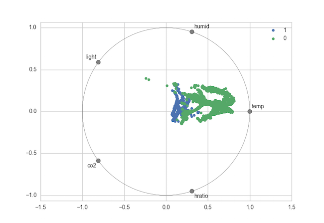  

```python
from pandas.tools.plotting import radviz

def rad_viz(df,labels):
    fig = radviz(df, labels, color=sns.color_palette())
    plt.show()

rad_viz(occupancy.ix[:,1:],'occupied')
```

### Parallel Coordinates
Parallel coordinates, like radviz plots, are a way to visualize clusters in data. Data points are represented as connected line segments. The x-axis units are not meaningful, and instead, each vertical line represents one attribute. One set of connected line segments represents one instance. Points that tend to cluster will appear closer together, and we look for thick chords or braids of lines of the same color that would indicate good class separability.

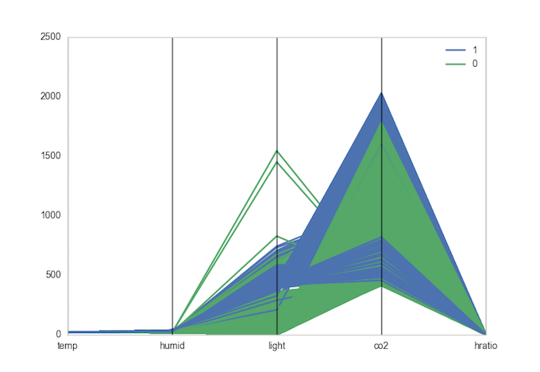    

```python
from pandas.tools.plotting import parallel_coordinates

def pcoord_viz(df, labels):
    fig = parallel_coordinates(df, labels, color=sns.color_palette())
    plt.show()

pcoord_viz(occupancy.ix[:,1:],'occupied')
```

Feature analysis can be a big challenge as the dimensionality of the data increases, even for experts. Frankly, there aren't a lot of tools out there for dealing with high-dimensional data. The options are generally hierarchical aggregation, dimensionality reduction (like PCA and LDA), and dimensional subsetting. For dimensional subsetting, one visual tactic is to use the scatterplot matrix approach to generate small multiples; another is to do a series of independent joint plots to examine the relationships and correlations between each possible pair of features. In the jointplot below, we can examine the relationship between the amounts of individuals' first bill in April and their last bill in September.


```python
def joint_viz(feat1,feat2,df):
    ax = sns.jointplot(feat1, feat2, data=df, kind='reg', size=6)
    plt.show()

joint_viz("apr_bill","sep_bill",credit)
```

## Demystifying model selection
In addition to being a practical and accessible way to augment the feature analysis process, visualizations can also help guide us to selecting the right machine learning algorithm for the job. Those who have used Scikit-Learn before will no doubt already be familiar with the [Choosing the Right Estimator](http://scikit-learn.org/stable/tutorial/machine_learning_map/) flow chart. This diagram is handy for those who are just getting started, as it models a(n albeit simplified) decision-making process for selecting the machine learning algorithm that is best suited to one's dataset.


Let's try it together. First we are asked whether we have more than 50 samples...

```python
print len(occupancy)
print len(credit)
print len(concrete)
```

...which we do for each of our three datasets (occupancy has 8,143; credit has 30,000; and concrete has 1,030). Next we're asked if we're predicting a category. For the occupancy and credit datasets, the answer is yes: for occupancy, we are predicting whether a room is occupied (0 for no, 1 for yes), and for credit, we are predicting whether the credit card holder defaulted on their payment (0 for no, 1 for yes). For the concrete dataset, the labels for the 'strength' of the concrete are continuous, so we are predicting a quantity not a category. Therefore, we will be looking for a classifier for our occupancy and credit datasets, and for a regressor for our concrete dataset.

Since both of our categorical datasets have fewer than 100,000 instances, we are prompted to start with `sklearn.svm.LinearSVC` (which will map the data to a higher dimensional feature space), or failing that, `sklearn.neighbors.KNeighborsClassifier` (which will assign instances to the class most common among its k nearest neighbors):    

```python
from sklearn.preprocessing import scale

from sklearn.svm import LinearSVC
from sklearn.neighbors import KNeighborsClassifier

# We'll divide our occupancy data into features (attributes) and labels (targets)
occ_features = occupancy[['temp', 'humid', 'light', 'co2', 'hratio']]
occ_labels   = occupancy['occupied']

# Let's scale our occupancy input vectors
standardized_occ_features = scale(occ_features)

# Then split the data into 'test' and 'train' for cross validation
splits = cv.train_test_split(standardized_occ_features, occ_labels, test_size=0.2)
X_train, X_test, y_train, y_test = splits

# We'll use the suggested LinearSVC model first
lin_clf = LinearSVC()
lin_clf.fit(X_train, y_train)
y_true = y_test
y_pred = lin_clf.predict(X_test)
print confusion_matrix(y_true, y_pred)

# Then try the k-nearest neighbor model next
knn_clf = KNeighborsClassifier()
knn_clf.fit(X_train, y_train)
y_true = y_test
y_pred = knn_clf.predict(X_test)
print confusion_matrix(y_true, y_pred)
```

Ok, let's do the credit default dataset next. As you'll remember from our visual exploration of the features, while there are two classes in this dataset, there are very few cases of default, meaning we should be prepared to see some manifestations of class imbalance in our classifier.

```python
# We'll divide our credit data into features (attributes) and labels (targets)
cred_features = credit[['limit', 'sex', 'edu', 'married', 'age', 'apr_delay', 'may_delay', \
                        'jun_delay', 'jul_delay', 'aug_delay', 'sep_delay', 'apr_bill', 'may_bill', \
                        'jun_bill', 'jul_bill', 'aug_bill', 'sep_bill', 'apr_pay', 'may_pay', \
                        'jun_pay', 'jul_pay', 'aug_pay', 'sep_pay']]
cred_labels   = credit['default']

# Scale it
standardized_cred_features = scale(cred_features)

# Then split into 'test' and 'train' for cross validation
splits = cv.train_test_split(standardized_cred_features, cred_labels, test_size=0.2)
X_train, X_test, y_train, y_test = splits

# We'll use the suggested LinearSVC model
lin_clf = LinearSVC()
lin_clf.fit(X_train, y_train)
y_true = y_test
y_pred = lin_clf.predict(X_test)
print confusion_matrix(y_true, y_pred)

# Then try k-nearest neighbor
knn_clf = KNeighborsClassifier()
knn_clf.fit(X_train, y_train)
y_true = y_test
y_pred = knn_clf.predict(X_test)
print confusion_matrix(y_true, y_pred)
```

Meanwhile for our concrete dataset, we must determine whether we think all of the features are important, or only a few of them. If we decide to keep all the features as is, the chart suggests using `sklearn.linear_model.RidgeRegression` (which will identify features that are less predictive and ensure they have less influence in the model) or possibly `sklearn.svm.SVR` with a linear kernel (which is similar to the linearSVC classifier). If we guess that some of the features are not important, we might decide instead to choose `sklearn.linear_model.Lasso` (which will drop out any features that aren't predictive) or `sklearn.linear_model.ElasticNet` (which will try to find a happy medium between the lasso and ridge methods, taking the linear combination of their L1 and L2 penalties). Let's try a few because, why not?    

```python
from sklearn.linear_model import Ridge, Lasso, ElasticNet

conc_features = concrete[['cement', 'slag', 'ash', 'water', 'superplast', 'coarse', 'fine', 'age']]
conc_labels   = concrete['strength']

splits = cv.train_test_split(conc_features, conc_labels, test_size=0.2)
X_train, X_test, y_train, y_test = splits

ridge_reg = Ridge()
ridge_reg.fit(X_train, y_train)
y_true = y_test
y_pred = ridge_reg.predict(X_test)
print "Mean squared error = %0.3f" % mse(y_true, y_pred)
print "R2 score = %0.3f" % r2_score(y_true, y_pred)

lasso_reg = Lasso()
lasso_reg.fit(X_train, y_train)
y_pred = lasso_reg.predict(X_test)
print "Mean squared error = %0.3f" % mse(y_true, y_pred)
print "R2 score = %0.3f" % r2_score(y_true, y_pred)

eln_reg = ElasticNet()
eln_reg.fit(X_train, y_train)
y_pred = eln_reg.predict(X_test)
print "Mean squared error = %0.3f" % mse(y_true, y_pred)
print "R2 score = %0.3f" % r2_score(y_true, y_pred)
```

Visualizations and flow diagrams of the model selection process like this can be helpful, especially when you're just getting started out with machine learning. Another example of a tool like this is Dr. Saed Sayad's ["data mining map"](http://www.saedsayad.com/data_mining_map.htm), which is much more comprehensive than the Scikit-Learn flow chart. In addition to predictive methods ('predicting the future'), Sayad's map also includes an entire section on 'explaining the past'. Below is our iteration on the Sayad map, a genealogical chart that aims to present the same broad algorithmic coverage for the 'predicting the future' models (in addition to representing some of the kinds of machine learning, like reinforcement learning, which are not represented in original). This version also integrates color to encourage experimentation within what Hadley Wickham [refers to](http://had.co.nz/stat645/model-vis.pdf) as 'model families':


Also, while unsupervised methods are beyond the scope of this post, it's worth noting that the Scikit-Learn [cluster comparison plot](http://scikit-learn.org/stable/auto_examples/cluster/plot_cluster_comparison.html) can be a useful tool for unsupervised model selection in that it depicts the substantial difference in the performance of clustering models across different datasets.


## Visual Evaluation in Scikit-Learn       
### Evaluating classifiers
In the previous section, when we ran each of our models, we also ran some standard metrics to get some feedback on how well the classifiers and regressors were performing.  In this section, we'll delve into those metrics with a bit more depth and explore how to deploy visualization tools from Scikit-Learn to better 'see' how our models are performing.

#### Confusion matrices and Classification Reports
The results of our classifiers were presented as confusion matrices, which looked something like this:    
```python
[[1238   19]
 [   2  370]]
 ```

We can use this diagram to help us interpret those results:     
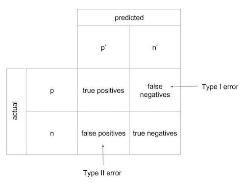   

True to their name, confusion matrices can sometimes be a bit difficult to unpack, particularly the more classes you have. We propose using classification reports instead, which include the same basic information as in a confusion matrix, but with several added advantages. First, where the confusion matrix merely labels whether instances have be classified properly or improperly, a classification report provides three different measures of accuracy: precision, recall, and F1 score. Moreover, the classification report can conveniently include the names of the labels for each of the classes, which helps a lot with interpretability. With some gentle manipulation of the built-in classification report metric in Scikit-Learn (`sklearn.metrics.classification_report`), we can also integrate a color-coded heatmap that will help guide our eye toward evaluating our predictive successes (the darkest reds) and weaknesses (the lightest pinks).

```python
def plot_classification_report(cr, title='Classification report', cmap=plt.cm.Reds):
    lines = cr.split('\n')
    classes = []
    matrix = []

    for line in lines[2:(len(lines)-3)]:
        s = line.split()
        classes.append(s[0])
        value = [float(x) for x in s[1: len(s) - 1]]
        matrix.append(value)

    fig, ax = plt.subplots(1)

    for column in range(len(matrix)+1):
        for row in range(len(classes)):
            txt = matrix[row][column]
            ax.text(column,row,matrix[row][column],va='center',ha='center')

    fig = plt.imshow(matrix, interpolation='nearest', cmap=cmap)
    plt.title(title)
    plt.colorbar()
    x_tick_marks = np.arange(len(classes)+1)
    y_tick_marks = np.arange(len(classes))
    plt.xticks(x_tick_marks, ['precision', 'recall', 'f1-score'], rotation=45)
    plt.yticks(y_tick_marks, classes)
    plt.ylabel('Classes')
    plt.xlabel('Measures')
    plt.show()
```

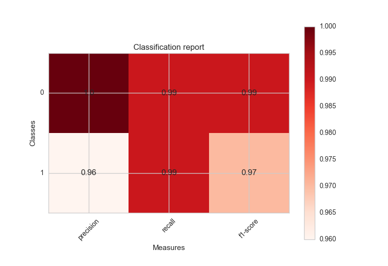  


#### ROC Curves
Another way to examine the performance of our classifiers is with the Receiver Operating Characteristic (ROC). We can import `metrics.roc_curve` from Scikit-Learn and call it on the result of our model in order to get a numeric calculation of the true positive and false positive rates, as well as the thresholds. Even better, we can plot the ROC to visualize the tradeoff between our classifier's sensitivity (how well it is optimized to find true positives) and its specificity (how well it is optimized to avoid false positives). In the plot, the x-axis indicates the false positive rate and the y-axis shows the true positive rate.

```python
from sklearn.metrics import auc
from sklearn.metrics import roc_curve

false_positive_rate, true_positive_rate, thresholds = roc_curve(y_true, y_pred)
roc_auc = auc(false_positive_rate, true_positive_rate)

plt.title('Receiver Operating Characteristic')
plt.plot(false_positive_rate, true_positive_rate, 'blue', label='AUC = %0.2f'% roc_auc)
plt.legend(loc='lower right')
plt.plot([0,1],[0,1],'m--')
plt.xlim([0,1])
plt.ylim([0,1.1])
plt.ylabel('True Positive Rate')
plt.xlabel('False Positive Rate')
plt.show()
```

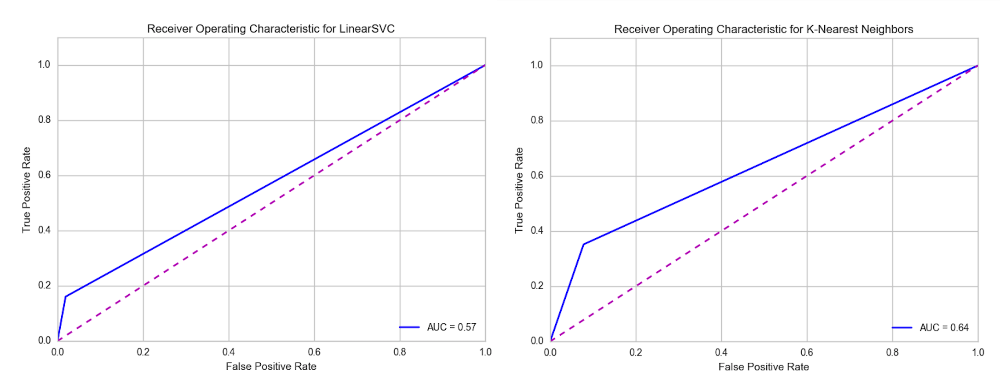

If your ROC curve is a straight horizontal line your classifier is perfect (which should make you a bit skeptical about your data...). If your curve is pulling a lot toward to the upper left corner, your classifier has good accuracy. If your curve is exactly aligned with the diagonal, your classifier is about as effective as a random coin toss.

We can also calculate the area under curve (AUC) and integrate that into our plot. If the AUC is greater than .80, your classifier is very strong. If your AUC is between .60 - .80, your classifier is good, but might be better if you keep tuning or change models. An AUC of less than .60 might lead you to question whether the features you are using are actually predictive.


### Evaluating Regressors
The results of our regression models were presented as mean squared errors and coefficients of determination, which looked something like this:    
```python
Mean squared error = 116.268
R2 score = 0.606
```

With regression, we can visualize how models perform for different features within the dataspace:
```python
def regrViz(model,X,y):
    plt.scatter(X, y,  color='black')
    plt.plot(X, model.predict(X), color='blue', linewidth=3)
    plt.xticks(())
    plt.yticks(())
    plt.show()

splits = cv.train_test_split(concrete[['water']], concrete['strength'], test_size=0.2)
X_train, X_test, y_train, y_test = splits
ridge_reg = Ridge()
ridge_reg.fit(X_train, y_train)
regrViz(ridge_reg, X_test, y_test)

splits = cv.train_test_split(concrete[['superplast']], concrete['strength'], test_size=0.2)
X_train, X_test, y_train, y_test = splits
ridge_reg = Ridge()
ridge_reg.fit(X_train, y_train)
regrViz(ridge_reg, X_test, y_test)

splits = cv.train_test_split(concrete[['cement']], concrete['strength'], test_size=0.2)
X_train, X_test, y_train, y_test = splits
ridge_reg = Ridge()
ridge_reg.fit(X_train, y_train)
regrViz(ridge_reg, X_test, y_test)
```

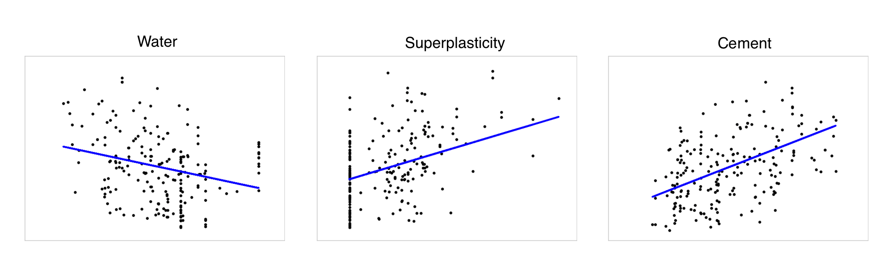

We can also visualize the prediction errors of different models with cross validation:

```python
def regrErrorViz(model,features,labels):
    predicted = cv.cross_val_predict(model, features, labels, cv=12)
    fig, ax = plt.subplots()
    ax.scatter(labels, predicted)
    ax.plot([labels.min(), labels.max()], [labels.min(), labels.max()], 'k--', lw=4)
    ax.set_xlabel('Measured')
    ax.set_ylabel('Predicted')
    plt.show()

regrErrorViz(Ridge(),conc_features, conc_labels)
regrErrorViz(SVR(),conc_features, conc_labels)
regrErrorViz(RANSACRegressor(),conc_features, conc_labels)
```

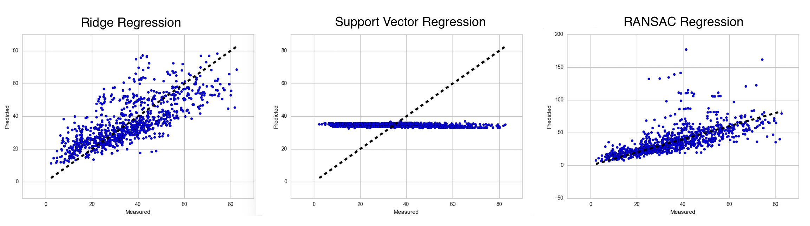

Finally, we can plot residuals to visualize error and the extent to which our model has captured the behavior of the data.  If the data points appear to be evenly dispersed around the plotted line, our model is performing well. If the data points appear to have some structure that does not coincide with the plotted line, we have failed to capture its behavior and should either consider a new model or an exploration of the hyperparameters.

```python
plt.scatter(model.predict(X_train), model.predict(X_train) - y_train, c='b', s=40, alpha=0.5)
plt.scatter(model.predict(X_test), model.predict(X_test) - y_test, c='g', s=40)
plt.hlines(y=0, xmin=0, xmax=50)
plt.title('Plotting residuals using training (blue) and test green) data')
plt.ylabel('Residuals')
```
## Advanced machine learning: Visual tuning
This kind of evaluation of our models should flow directly into a reflection on the models we initially selected, in some cases leading us to choose different models. However, our model evaluations should also prompt us to consider tuning. As you may have noticed, for every model we have used so far, we have accepted the default Scikit-Learn parameters and employed absolutely no hyperparameter tuning whatsoever. Getting good at tuning a model by adjusting its parameters is the next step to getting good at machine learning. How do you pick the best parameters? Most people use a grid search technique, establishing a range of parameters for the model to experiment with and then select the best performing. The downside of this approach is that it is largely a blind search. The best case scenario is that you end up with a better performing model but no additional intuition around tuning. A more common scenario is that you don't end up with a better model or more intuition.  


With grid search, the effective selection of the range of hyperparameters to search within requires some understanding of what parameters are available, what those parameters mean, what impact they can have on a model, and what a reasonable search space might be. Instead of using grid search (or using just grid search), we suggest trying...


### Visualizing variance and bias with validation curves

Training vs. validation scores of model for different values of a hyperparameter.

What information do we get from each plot?

Training score and validation score both low => Underfit
Training score high and validation score low => Overfit


```python
import numpy as np
import matplotlib.pyplot as plt
from sklearn.learning_curve import validation_curve

param_range = np.logspace(-7, 3, 5)

train_scores, test_scores = validation_curve(SVC(), X, y, param_name="gamma",
param_range=param_range, cv=10, scoring="accuracy", n_jobs=1)
train_scores_mean = np.mean(train_scores, axis=1)
train_scores_std = np.std(train_scores, axis=1)
test_scores_mean = np.mean(test_scores, axis=1)
test_scores_std = np.std(test_scores, axis=1)

plt.semilogx(param_range, train_scores_mean, label="Training score", color="r")
plt.semilogx(param_range, test_scores_mean, label="Cross-validation score", color="g")

plt.show()
```


##  Can we do better? A view of the model selection triple
Discussions of machine learning frequently revolve around model selection. Whether it's logistic regression, neural nets, support vector machines, random forests, or Bayesian methods, everyone seems to have their favorite! These discussions tend to truncate the challenges of machine learning into a single problem. Sure, picking a good model is important, but it's certainly not enough (and it's debatable whether a model can actually be 'good' devoid of the context of the domain, the hypothesis, the shape of the data, the intended application, etc.). To produce a fitted model that is well-suited to the data, predictive, and also performant requires thoughtful featuring analysis and parameter tuning. This trio of steps (feature selection, model selection, and tuning) have been referred to as the [model selection triple](http://pages.cs.wisc.edu/~arun/vision/SIGMODRecord15.pdf).

One of the reasons that machine learning practitioners don't often talk about the model selection triple is because it's hard to describe. As Kumar et al. (2015) suggest, "Model selection is iterative and exploratory because the space of [model selection triples] is usually infinite, and it is generally impossible for analysts to know a priori which [combination] will yield satisfactory accuracy and/or insights." In other words, this is the part that makes machine learning _hard_. The process is complex, iterative, and disjointed, often with many missteps and restarts along the way. And yet these iterations are central to the science of machine learning &mdash; the way to optimize is not to limit but to facilitate those iterations, which can be done by integrating visual diagnostics into each part of the model selection triple workflow.     

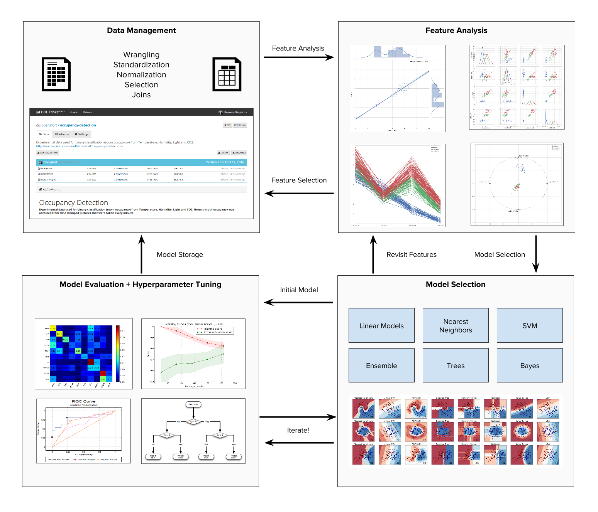


## Conclusion    
Although many of us tend to think of graphs and diagrams as the end phase of the pipeline, visualization has a critical role to play throughout the analytic process. Whether you have an academic background in predictive methods or not, visual diagnostics are the key to augmenting the algorithms already implemented in Python.

...models' performance, stability, and predictive value


## Resources and Helpful Links    
[Visualizing Statistical Models: Removing the Blindfold by Hadley Wickham et al.](http://had.co.nz/stat645/model-vis.pdf)
[Model Selection Management Systems by Arun Kumar et al.](http://pages.cs.wisc.edu/~arun/vision/)
[A Visual Introduction to Machine Learning](http://www.r2d3.us/visual-intro-to-machine-learning-part-1/)    
[The Scikit-Learn Algorithm Cheatsheet](http://scikit-learn.org/stable/tutorial/machine_learning_map/)    
[Visualizing Machine Learning Thresholds](http://blog.insightdatalabs.com/visualizing-classifier-thresholds/)     
[Plotting SVM Classifiers](http://scikit-learn.org/stable/auto_examples/svm/plot_iris.html#example-svm-plot-iris-py)    
[Introduction to ROC Analysis](https://ccrma.stanford.edu/workshops/mir2009/references/ROCintro.pdf)    
[Visualizing Representations](http://colah.github.io/posts/2015-01-Visualizing-Representations/)    
