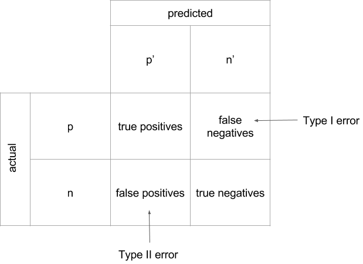
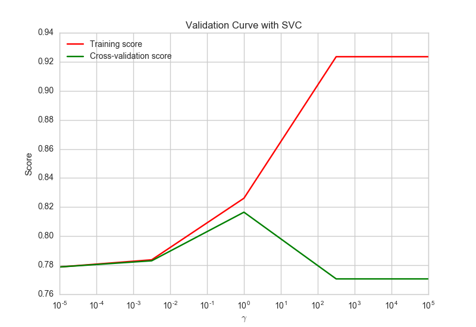
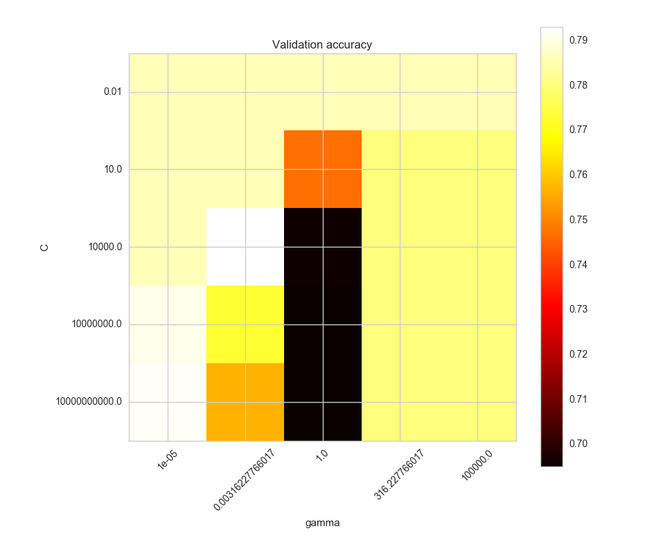

# Visual Diagnostics for More Informed Machine Learning

> How could they see anything but the shadows if they were never allowed to move their heads?
>
> &mdash; <cite> Plato [_The Allegory of the Cave_](http://classics.mit.edu/Plato/republic.8.vii.html)</cite>


Python and high level libraries like Scikit-learn, TensorFlow, NLTK, PyBrain, Theano, and MLPY have made machine learning accessible to a broad programming community that might never have found it otherwise. With the democratization of these tools, there is now a large, and growing, population of machine learning practitioners who are primarily self-taught. At the same time, the stakes of machine learning have never been higher; predictive tools are driving decision-making in every sector, from business, art, and engineering to education, law, and defense.

How do we ensure our predictions are valid and robust in a time when these few lines of Python...

```python
from sklearn.linear_model import LinearRegression
model = LogisticRegression()
model.fit(X,y)
model.predict(X)
```

...can instantiate and fit a model? How do you build intuition around what initial model to select? Which features do you use? Which should you normalize? How do you identify problems like local minima and overfit? Can you get a weak model to perform better?

To help us think through these questions, let's take a look at the following four 2-dimensional arrays, imagining that we want to produce predictive models for each:    

```python
import numpy as np

i   = np.array([[10.0, 8.0, 13.0, 9.0, 11.0, 14.0, 6.0, 4.0, 12.0, 7.0, 5.0],\
               [8.04, 6.95, 7.58, 8.81, 8.33, 9.96, 7.24, 4.26, 10.84, 4.82, 5.68]])
ii  = np.array([[10.0, 8.0, 13.0, 9.0, 11.0, 14.0, 6.0, 4.0, 12.0, 7.0, 5.0],\
               [9.14, 8.14, 8.74, 8.77, 9.26, 8.10, 6.13, 3.10, 9.13, 7.26, 4.74]])
iii = np.array([[10.0, 8.0, 13.0, 9.0, 11.0, 14.0, 6.0, 4.0, 12.0, 7.0, 5.0],\
               [7.46, 6.77, 12.74, 7.11, 7.81, 8.84, 6.08, 5.39, 8.15, 6.42, 5.73]])
iv  = np.array([[8.0, 8.0, 8.0, 8.0, 8.0, 8.0, 8.0, 19.0, 8.0, 8.0, 8.0],\
               [6.58, 5.76, 7.71, 8.84, 8.47, 7.04, 5.25, 12.50, 5.56, 7.91, 6.89]])
```

What kind of model should we use to fit our data? Let's compute some statistical properties for each: the mean and variance, the correlation coefficient, and the slope and intercept of their linear regression.

```python
from scipy import stats

def getStats(twoDarray):
    print np.mean(twoDarray[0])
    print np.mean(twoDarray[1])
    print np.var(twoDarray[0])
    print np.var(twoDarray[1])
    print np.corrcoef(twoDarray[0],twoDarray[1])
    print stats.linregress(twoDarray[0],twoDarray[1])

getStats(i)
getStats(ii)
getStats(iii)
getStats(iv)
```

It turns out that from a statistical standpoint, the four arrays nearly identical! This might lead us to decide to use a single model for each, maybe `sklearn.linear_model.LinearRegression`? And yet, if we were to plot the points for each of the datasets, we would see that they are not at all alike:    


```python
import matplotlib.pyplot as plt

def makePlot(twoDarray):
    fig = plt.figure()
    x = twoDarray[0]
    y = twoDarray[1]
    plt.scatter(x, y, c='g')
    axes = plt.gca()
    m, b = np.polyfit(x, y, 1)
    X_plot = np.linspace(axes.get_xlim()[0],axes.get_xlim()[1],100)
    plt.plot(X_plot, m*X_plot + b, '-')
    plt.show()

makePlot(i)
makePlot(ii)
makePlot(iii)
makePlot(iv)
```  

More importantly, a simple linear regression model is not going to perform equally well on each. While we can see a linear relationship in __i__ and __iii__, their regression lines are substantially different. In the __ii__ plot, we can see that the variables are related but not linearly correlated, and also that they are not normally distributed. Moreover, both the __iii__ and the __iv__ datasets contain outliers big enough to strongly influence the correlation coefficients.

Assembled by English statistician Frank Anscombe in 1973, the takeaway from these four datasets, known as [Anscombe's Quartet](https://en.wikipedia.org/wiki/Anscombe%27s_quartet), and their corresponding visualizations is that of all of the analytical tools at our disposal, sometimes our eyes are the most important. In data science, visual diagnostics are a powerful but frequently underestimated tool. Visualizations don't have to be the end of the pipeline. They can allow us to find patterns we simply cannot see by looking at raw data alone. Where static outputs and tabular data may render patterns opaque, human visual analysis can uncover volumes and lead to more robust programming and better data products. In machine learning, where lots of things can cause trouble (messy data, overtraining, undertuning, the curse of dimensionality, etc.) visual diagnostics can mean the difference between a model that crashes and burns, and one that predicts the future. In this post, I'd like to show how visualization tools can offer analytical support at several key stages in the machine learning process. I'll demonstrate how to deploy some of the visualization tools from the standard Scikit-Learn and Matplotlib libraries (along with a few tricks from Pandas, Bokeh, and Seaborn) and illustrate how visual diagnostics can support the machine learning workflow, including feature analysis, model selection, and parameter tuning.


## A Range of datasets  
In order to explore these visualization methods in a variety of contexts, we'll be using a few different datasets from the [UCI Machine Learning Repository](http://archive.ics.uci.edu/ml/):

1. [Detecting Room Occupancy](http://archive.ics.uci.edu/ml/datasets/Occupancy+Detection+) from light, humidity, CO2, etc.    
2. [Predicting Default in Credit Card Clients](http://archive.ics.uci.edu/ml/datasets/default+of+credit+card+clients) from sex, education, marital status, age, and payment history.     
3. [Predicting Concrete Compressive Strength](http://archive.ics.uci.edu/ml/datasets/Concrete+Compressive+Strength) from its age and ingredients.   

Here is a simple function that uses the Python `requests` module to go to the UCI page to fetch all three:

```python
import os
import zipfile
import requests

OCCUPANCY = "http://archive.ics.uci.edu/ml/machine-learning-databases/00357/occupancy_data.zip"
CREDIT    = "http://archive.ics.uci.edu/ml/machine-learning-databases/00350/default%20of%20credit%20card%20clients.xls"
CONCRETE  = "http://archive.ics.uci.edu/ml/machine-learning-databases/concrete/compressive/Concrete_Data.xls"

def download_data(url, path='data'):
    if not os.path.exists(path):
        os.mkdir(path)

    response = requests.get(url)
    name = os.path.basename(url)
    with open(os.path.join(path, name), 'w') as f:
        f.write(response.content)

download_data(OCCUPANCY)
download_data(CREDIT)
download_data(CONCRETE)

z = zipfile.ZipFile(os.path.join('data', 'occupancy_data.zip'))
z.extractall(os.path.join('data', 'occupancy_data'))
```


## More intuitive feature analysis and selection

Feature selection is key to successful machine learning. Here the objective is to find the smallest set of the available features such that the fitted model will reach it's maximal predictive value. Statistical measures like averages and variance are a very useful first step to unpacking the features. Now that we've got our data, let's import `pandas`, load each into a data frame and take a quick look:

```python
import pandas as pd

occupancy   = pd.read_csv(os.path.join('data','occupancy_data','datatraining.txt'), sep=",")
occupancy.columns = ['date', 'temp', 'humid', 'light', 'co2', 'hratio', 'occupied']
print occupancy.head()
print occupancy.describe()

credit      = pd.read_excel(os.path.join('data','default%20of%20credit%20card%20clients.xls'), header=1)
credit.columns = ['id','limit','sex','edu','married','age','apr_delay','may_delay','jun_delay','jul_delay',\
                  'aug_delay','sep_delay','apr_bill','may_bill','jun_bill','jul_bill','aug_bill','sep_bill',\
                  'apr_pay','may_pay','jun_pay','jul_pay','aug_pay','sep_pay','default']
print credit.head()
print credit.describe()

concrete   = pd.read_excel(os.path.join('data','Concrete_Data.xlsx'))
concrete.columns = ['cement', 'slag', 'ash', 'water', 'splast', 'coarse', 'fine','age','strength']
print concrete.head()
print concrete.describe()
```

We can start to get a feel for the differences across our three datasets from the output of the `.describe()` statements above. For example, in the occupancy dataset, the standard deviations for light and CO2 emissions are two orders of magnitude greater than they are for temperature and humidity, meaning that some scaling may be necessary. In the credit card default dataset, the distribution of the labels (0 for credit card holders who did not default on the payment and 1 for those who did) appears uneven, which can be an indicator of possible class imbalance.  But, if you had to select which features were most likely to be predictive based solely on the descriptive tables, it would be pretty tough, especially without domain expertise (what the heck is superplasticity?). At this point, those who have some experience with predictive modeling will often begin to visualize the data so that they can see the behavior of the different feature vectors.

### Boxplots
Boxplots (or 'box-and-whisker' plots) enable us to look at the central tendency of the data, see the distribution, and examine outliers. In the example below, each feature of the concrete dataset is listed out on the x-axis and for each feature, we get to visualize the data's behavior. The boxes indicate the upper and lower quartiles of the data, the black line in the center of each box indicates the median, the whiskers show the biggest and smallest values (with the outliers excluded), and the diamonds show the outliers.

   

```python
import seaborn as sns
import matplotlib.pyplot as plt

sns.set_style("whitegrid")

def box_viz(df):
    ax = sns.boxplot(df)
    plt.xticks(rotation=60)
    plt.show()

box_viz(concrete)
```

[Violinplots](https://stanford.edu/~mwaskom/software/seaborn/generated/seaborn.violinplot.html) are a nice alternative to traditional box-and-whiskers, because they provide the same information but also reflect relative kernel density estimates, which can be useful when looking for separability.

### Histograms
Histograms enable us to bin the values into buckets and visualize the frequency of those values in terms of the relative size of each bucket. The below graph is a histogram of the age feature vector in the credit card default dataset. The histogram tells us that most of the people represented in the data are under the age of 40.


```python
def hist_viz(df,feature):
    ax = sns.distplot(df[feature])
    plt.xlabel(feature)
    plt.show()

hist_viz(credit,'age')
```

### Scatter Plot Matrices
Scatterplot matrices (or 'sploms') are one of our favorite feature analysis tools. We plot all of the pairwise scatterplots of the features in a single matrix, where the diagonal is generally left blank or used to display kernel density estimates, histograms, or feature labels. Sploms are a way to check the pairwise relationships between features. When we look at a scatterplot matrix, we are looking for covariance, for relationships that appear to be linear, quadratic, or exponential, and for either homoscedastic or heteroscedastic behavior that will tell us how the features are dispersed relative to each other. In the scatterplot for the concrete dataset below, we can see what appears to be heteroscedastic behavior in the pairwise plot of strength and cement content.  


```python
def splom_viz(df,labels=None):
    ax = sns.pairplot(df, hue=labels, diag_kind="kde", size=2)
    plt.show()

splom_viz(concrete)
```

### Radviz
Radial visualizations are based on a spring tension minimization algorithm. The features of the dataset are equally spaced on a unit circle and the instances are dropped into the center of the circle. The features then 'pull' the instances towards their position on the circle in proportion to their normalized numerical value for that instance. In the radviz graph for the occupancy dataset below, we can see that there is some definite separation between the rooms that are labeled as occupied and those that are vacant. Moreover, it appears that temperature seems to be one of the more predictive features, given how strongly the green dots (the unoccupied rooms) are being 'pulled' towards that part of the circle.

  

```python
from pandas.tools.plotting import radviz

def rad_viz(df,labels):
    fig = radviz(df, labels, color=sns.color_palette())
    plt.show()

rad_viz(occupancy.ix[:,1:],'occupied')
```

### Parallel Coordinates
Parallel coordinates, like radviz plots, are a way to visualize clusters in data. Data points are represented as connected line segments. The x-axis units are not meaningful, and instead, each vertical line represents one attribute. One set of connected line segments represents one instance. Points that tend to cluster will appear closer together, and we look for thick chords or braids of lines of the same color that would indicate good class separability.

    

```python
from pandas.tools.plotting import parallel_coordinates

def pcoord_viz(df, labels):
    fig = parallel_coordinates(df, labels, color=sns.color_palette())
    plt.show()

pcoord_viz(occupancy.ix[:,1:],'occupied')
```

Feature analysis can be a big challenge as the dimensionality of the data increases, even for experts. Frankly, there aren't a lot of tools out there for dealing with high-dimensional data. The options are generally hierarchical aggregation, dimensionality reduction (like PCA and LDA), and dimensional subsetting. For dimensional subsetting, one visual tactic is to use the scatterplot matrix approach to generate small multiples; another is to do a series of independent joint plots to examine the relationships and correlations between each possible pair of features. In the jointplot below, we can examine the relationship between the amounts of individuals' first bill in April and their last bill in September.


```python
def joint_viz(feat1,feat2,df):
    ax = sns.jointplot(feat1, feat2, data=df, kind='reg', size=5)
    plt.xticks(rotation=60)
    plt.show()

joint_viz("apr_bill","sep_bill",credit)
```

## Demystifying model selection
In addition to being a practical and accessible way to augment the feature analysis process, visualizations can also help guide us to selecting the right machine learning algorithm for the job. Those who have used Scikit-Learn before will no doubt already be familiar with the [Choosing the Right Estimator](http://scikit-learn.org/stable/tutorial/machine_learning_map/) flow chart. This diagram is handy for those who are just getting started, as it models a(n albeit simplified) decision-making process for selecting the machine learning algorithm that is best suited to one's dataset.


Let's try it together. First we are asked whether we have more than 50 samples...

```python
print len(occupancy)
print len(credit)
print len(concrete)
```

...which we do for each of our three datasets (occupancy has 8,143; credit has 30,000; and concrete has 1,030). Next we're asked if we're predicting a category. For the occupancy and credit datasets, the answer is yes: for occupancy, we are predicting whether a room is occupied (0 for no, 1 for yes), and for credit, we are predicting whether the credit card holder defaulted on their payment (0 for no, 1 for yes). For the concrete dataset, the labels for the 'strength' of the concrete are continuous, so we are predicting a quantity not a category. Therefore, we will be looking for a classifier for our occupancy and credit datasets, and for a regressor for our concrete dataset.

Since both of our categorical datasets have fewer than 100,000 instances, we are prompted to start with `sklearn.svm.LinearSVC` (which will map the data to a higher dimensional feature space), or failing that, `sklearn.neighbors.KNeighborsClassifier` (which will assign instances to the class most common among its k nearest neighbors):    

```python
from sklearn.preprocessing import scale

from sklearn.svm import LinearSVC
from sklearn.neighbors import KNeighborsClassifier

# We'll divide our occupancy data into features (attributes) and labels (targets)
occ_features = occupancy[['temp', 'humid', 'light', 'co2', 'hratio']]
occ_labels   = occupancy['occupied']

# Let's scale our occupancy input vectors
standardized_occ_features = scale(occ_features)

# Then split the data into 'test' and 'train' for cross validation
splits = cv.train_test_split(standardized_occ_features, occ_labels, test_size=0.2)
X_train, X_test, y_train, y_test = splits

# We'll use the suggested LinearSVC model first
lin_clf = LinearSVC()
lin_clf.fit(X_train, y_train)
y_true = y_test
y_pred = lin_clf.predict(X_test)
print confusion_matrix(y_true, y_pred)

# Then try the k-nearest neighbor model next
knn_clf = KNeighborsClassifier()
knn_clf.fit(X_train, y_train)
y_true = y_test
y_pred = knn_clf.predict(X_test)
print confusion_matrix(y_true, y_pred)
```

Ok, let's do the credit default dataset next. As you'll remember from our visual exploration of the features, while there are two classes in this dataset, there are very few cases of default, meaning we should be prepared to see some manifestations of class imbalance in our classifier.

```python
# We'll divide our credit data into features (attributes) and labels (targets)
cred_features = credit[['limit', 'sex', 'edu', 'married', 'age', 'apr_delay', 'may_delay', \
                        'jun_delay', 'jul_delay', 'aug_delay', 'sep_delay', 'apr_bill', 'may_bill', \
                        'jun_bill', 'jul_bill', 'aug_bill', 'sep_bill', 'apr_pay', 'may_pay', \
                        'jun_pay', 'jul_pay', 'aug_pay', 'sep_pay']]
cred_labels   = credit['default']

# Scale it
standardized_cred_features = scale(cred_features)

# Then split into 'test' and 'train' for cross validation
splits = cv.train_test_split(standardized_cred_features, cred_labels, test_size=0.2)
X_train, X_test, y_train, y_test = splits

# We'll use the suggested LinearSVC model
lin_clf = LinearSVC()
lin_clf.fit(X_train, y_train)
y_true = y_test
y_pred = lin_clf.predict(X_test)
print confusion_matrix(y_true, y_pred)

# Then try k-nearest neighbor
knn_clf = KNeighborsClassifier()
knn_clf.fit(X_train, y_train)
y_true = y_test
y_pred = knn_clf.predict(X_test)
print confusion_matrix(y_true, y_pred)
```

Meanwhile for our concrete dataset, we must determine whether we think all of the features are important, or only a few of them. If we decide to keep all the features as is, the chart suggests using `sklearn.linear_model.RidgeRegression` (which will identify features that are less predictive and ensure they have less influence in the model) or possibly `sklearn.svm.SVR` with a linear kernel (which is similar to the linearSVC classifier). If we guess that some of the features are not important, we might decide instead to choose `sklearn.linear_model.Lasso` (which will drop out any features that aren't predictive) or `sklearn.linear_model.ElasticNet` (which will try to find a happy medium between the lasso and ridge methods, taking the linear combination of their L1 and L2 penalties). Let's try a few because, why not?    

```python
from sklearn.linear_model import Ridge, Lasso, ElasticNet

conc_features = concrete[['cement', 'slag', 'ash', 'water', 'superplast', 'coarse', 'fine', 'age']]
conc_labels   = concrete['strength']

splits = cv.train_test_split(conc_features, conc_labels, test_size=0.2)
X_train, X_test, y_train, y_test = splits

ridge_reg = Ridge()
ridge_reg.fit(X_train, y_train)
y_true = y_test
y_pred = ridge_reg.predict(X_test)
print "Mean squared error = %0.3f" % mse(y_true, y_pred)
print "R2 score = %0.3f" % r2_score(y_true, y_pred)

lasso_reg = Lasso()
lasso_reg.fit(X_train, y_train)
y_pred = lasso_reg.predict(X_test)
print "Mean squared error = %0.3f" % mse(y_true, y_pred)
print "R2 score = %0.3f" % r2_score(y_true, y_pred)

eln_reg = ElasticNet()
eln_reg.fit(X_train, y_train)
y_pred = eln_reg.predict(X_test)
print "Mean squared error = %0.3f" % mse(y_true, y_pred)
print "R2 score = %0.3f" % r2_score(y_true, y_pred)
```

Visualizations and flow diagrams of the model selection process like this can be helpful, especially when you're just getting started out with machine learning. Another example of a tool like this is Dr. Saed Sayad's ["data mining map"](http://www.saedsayad.com/data_mining_map.htm), which is much more comprehensive than the Scikit-Learn flow chart. In addition to predictive methods ('predicting the future'), Sayad's map also includes an entire section on 'explaining the past'. Below is our iteration on the Sayad map, a genealogical chart that aims to present the same broad algorithmic coverage for the 'predicting the future' models (in addition to representing some of the kinds of machine learning, like reinforcement learning, which are not represented in original). This version also integrates color to encourage experimentation within what Hadley Wickham [refers to](http://had.co.nz/stat645/model-vis.pdf) as 'model families':


Also, while unsupervised methods are beyond the scope of this post, it's worth noting that the Scikit-Learn [cluster comparison plot](http://scikit-learn.org/stable/auto_examples/cluster/plot_cluster_comparison.html) can be a useful tool for unsupervised model selection in that it depicts the substantial difference in the performance of clustering models across different datasets.


## Visual evaluation and tuning in Scikit-Learn       
### Evaluating classifiers
In the previous section, when we ran each of our models, we also ran some standard metrics to get some feedback on how well the classifiers and regressors were performing.  In this section, we'll delve into those metrics with a bit more depth and explore how to deploy visualization tools from Scikit-Learn to better 'see' how our models are performing.

#### Confusion matrices and classification reports
The results of our classifiers were presented as confusion matrices, which looked something like this:    
```python
[[1238   19]
 [   2  370]]
 ```

We can use this diagram to help us interpret those results:     
   

True to their name, confusion matrices can sometimes be a bit difficult to unpack, particularly the more classes you have. We propose using classification reports instead, which include the same basic information as in a confusion matrix, but with several added advantages. First, where the confusion matrix merely labels whether instances have be classified properly or improperly, a classification report provides three different measures of accuracy: precision, recall, and F1 score. Moreover, the classification report can conveniently include the names of the labels for each of the classes, which helps a lot with interpretability. With some gentle manipulation of the built-in classification report metric in Scikit-Learn (`sklearn.metrics.classification_report`), we can also integrate a color-coded heatmap that will help guide our eye toward evaluating our predictive successes (the darkest reds) and weaknesses (the lightest pinks).

  

```python
def plot_classification_report(cr, title='Classification report', cmap=plt.cm.Reds):
    lines = cr.split('\n')
    classes = []
    matrix = []

    for line in lines[2:(len(lines)-3)]:
        s = line.split()
        classes.append(s[0])
        value = [float(x) for x in s[1: len(s) - 1]]
        matrix.append(value)

    fig, ax = plt.subplots(1)

    for column in range(len(matrix)+1):
        for row in range(len(classes)):
            txt = matrix[row][column]
            ax.text(column,row,matrix[row][column],va='center',ha='center')

    fig = plt.imshow(matrix, interpolation='nearest', cmap=cmap)
    plt.title(title)
    plt.colorbar()
    x_tick_marks = np.arange(len(classes)+1)
    y_tick_marks = np.arange(len(classes))
    plt.xticks(x_tick_marks, ['precision', 'recall', 'f1-score'], rotation=45)
    plt.yticks(y_tick_marks, classes)
    plt.ylabel('Classes')
    plt.xlabel('Measures')
    plt.show()
```

#### ROC Curves
Another way to examine the performance of our classifiers is with the Receiver Operating Characteristic (ROC). We can import `metrics.roc_curve` from Scikit-Learn and call it on the result of our model in order to get a numeric calculation of the true positive and false positive rates, as well as the thresholds. Even better, we can plot the ROC to visualize the tradeoff between our classifier's sensitivity (how well it is optimized to find true positives) and its specificity (how well it is optimized to avoid false positives). In the plot, the x-axis indicates the false positive rate and the y-axis shows the true positive rate.


```python
from sklearn.metrics import auc
from sklearn.metrics import roc_curve

def rocViz(y, yhat, model):
    false_positive_rate, true_positive_rate, thresholds = roc_curve(y,yhat)
    roc_auc = auc(false_positive_rate, true_positive_rate)
    plt.title('Receiver Operating Characteristic for %s' % model)
    plt.plot(false_positive_rate, true_positive_rate, 'blue', label='AUC = %0.2f'% roc_auc)
    plt.legend(loc='lower right')
    plt.plot([0,1],[0,1],'m--')
    plt.xlim([0,1])
    plt.ylim([0,1.1])
    plt.ylabel('True Positive Rate')
    plt.xlabel('False Positive Rate')
    plt.show()

rocViz(y_true,y_pred,"Linear SVC Model")
rocViz(y_true,y_pred,"K-Nearest Neighbor Model")
```

If your ROC curve is a straight horizontal line, your classifier is perfect (which should make you a bit skeptical about your data...). If your curve is pulling a lot toward to the upper left corner, your classifier has good accuracy. If your curve is exactly aligned with the diagonal, your classifier is about as effective as a random coin toss.

We can also calculate the area under curve (AUC) and integrate that into our plot. If the AUC is greater than .80, your classifier is very strong. If your AUC is between .60 - .80, your classifier is good, but might be better if you keep tuning or change models. An AUC of less than .60 might lead you to question whether the features you are using are actually predictive.


### Evaluating regressors
Let's say we want to experiment with a few different models for our concrete dataset and then determine which one performs the best. In the above examples, the standard output for our regression models is presented in terms of the mean squared errors and coefficients of determination, which looked something like this:    
```python
Mean squared error = 116.268
R2 score = 0.606
```

The numeric scores are helpful, but they don't give us a good feel for _why_ a certain model is outperforming another, and they don't tell us how to tune the parameters of our models so that we can improve the scores. With regression, two visual evaluation techniques that can help us with diagnosing model deficiencies are prediction error plots and residual plots.

#### Prediction error plots
To get a sense of how often our model is predicting values that are close to the expected values, we'll plot the actual label column from the concrete dataset (which indicates the strength of the concrete) against the predicted value generated by each of our models. What we're looking for here is a clear relationship between the predicted and actual values.    


```python
def regrErrorViz(model,features,labels):
    predicted = cv.cross_val_predict(model, features, labels, cv=12)
    fig, ax = plt.subplots()
    ax.scatter(labels, predicted)
    ax.plot([labels.min(), labels.max()], [labels.min(), labels.max()], 'k--', lw=4)
    ax.set_xlabel('Measured')
    ax.set_ylabel('Predicted')
    plt.show()

regrErrorViz(Ridge(),conc_features, conc_labels)
regrErrorViz(SVR(),conc_features, conc_labels)
regrErrorViz(RANSACRegressor(),conc_features, conc_labels)
```

#### Residual plots
A residual is the difference between the labeled value and the predicted value for each instance in our dataset. We can plot residuals to visualize the extent to which our model has captured the behavior of the data. By plotting the residuals for a series of instances, we can check whether they're consistent with random error; we should not be able to predict the error for any given instance. If the data points appear to be evenly (randomly) dispersed around the plotted line, our model is performing well. What we're looking for is a mostly symmetrical distribution with points that tend to cluster towards the middle of the plot, ideally around smaller numbers of the y-axis. If we observe some kind of structure that does not coincide with the plotted line, we have failed to capture the behavior of the data and should either consider some feature engineering, selecting a new model, or an exploration of the hyperparameters.


```python
def plotResids(features,labels,model):
    for feature in list(features):
        splits = cv.train_test_split(features[[feature]], labels, test_size=0.2)
        X_train, X_test, y_train, y_test = splits
        model.fit(X_train, y_train)
        plt.scatter(model.predict(X_train), model.predict(X_train) - y_train, c='b', s=40, alpha=0.5)
        plt.scatter(model.predict(X_test), model.predict(X_test) - y_test, c='g', s=40)
    plt.hlines(y=0, xmin=0, xmax=100)
    plt.title('Plotting residuals using training (blue) and test (green) data')
    plt.ylabel('Residuals')
    plt.xlim([20,70])        # Adjust according to your dataset
    plt.ylim([-50,50])       # Adjust according to your dataset
    plt.show()

plotResids(conc_features,conc_labels,Ridge())
plotResids(conc_features,conc_labels,LinearRegression())
plotResids(conc_features,conc_labels,SVR())
```

We can also diagnose specific problems by looking to the particular kinds of structures we observe in plots of non-random residuals. For example, an average value of _y_ that is not zero given thin vertical strips of the graph is indicative of bias.  A plot with points that are not even distributed across the x-axis is evidence of heteroscedastic residuals. Both can often be addressed through hyperparameter tuning to strengthen the predictive power of the model.


### Advanced machine learning: Visual tuning
This kind of evaluation of our models should flow directly into a reflection on the models we initially selected, in some cases leading us to choose different models. However, our model evaluations should also prompt us to consider tuning. As you may have noticed, for every model we have used so far, we have accepted the default Scikit-Learn parameters and employed absolutely no hyperparameter tuning whatsoever. Getting good at tuning a model by adjusting its parameters is the next step to getting good at machine learning.

#### Visualizing variance and bias with validation curves

How do you pick the best parameters? One method is to use validation curves to visualize training and validation scores of a model through different values of a single hyperparameter. Let's experiment with a `SVC()` classifier for our credit card default data set. We'll make a validation curve by plotting the training scores and validation scores along different values of the kernel coefficient _gamma_.     

What we're looking for is the spot with the highest value for both the training and the validation scores. If both scores are low, it's an indication of underfit. If the training score is high but the validation score is low, it's an indication of overfit.

    

```python
from sklearn.learning_curve import validation_curve

X = standardized_cred_features[:,0:6] # We'll just use the first few columns
y = cred_labels
p_range = np.logspace(-5, 5, 5)
train_scores, test_scores = validation_curve(SVC(), X, y, param_name="gamma",
                            param_range=p_range, cv=6, scoring="accuracy", n_jobs=1)
train_scores_mean = np.mean(train_scores, axis=1)
train_scores_std = np.std(train_scores, axis=1)
test_scores_mean = np.mean(test_scores, axis=1)
test_scores_std = np.std(test_scores, axis=1)
plt.title("Validation Curve with SVC")
plt.xlabel("$\gamma$")
plt.ylabel("Score")
plt.semilogx(p_range, train_scores_mean, label="Training score", color="r")
plt.semilogx(p_range, test_scores_mean, label="Cross-validation score", color="g")
plt.legend(loc="best")
plt.show()
```


#### Gridsearch plotting
When it comes to hyperparameter tuning, most people use grid search. Grid searching entails establishing a range of values for multiple parameters to let the model test, and then having it select the best values for each of the parameters. For example, in our `SVC` model for the credit data set, we could try to improve our accuracy by experimenting with different values for _gamma_ as well as for the penalty parameter _C_ of the error term:

```python
from sklearn.grid_search import GridSearchCV

C_range = np.logspace(-2, 10, 5)
gamma_range = np.logspace(-5, 5, 5)
param_grid = dict(gamma=gamma_range, C=C_range)
grid = GridSearchCV(SVC(), param_grid=param_grid)
grid.fit(X, y)

print("The best parameters are %s with a score of %0.2f"
      % (grid.best_params_, grid.best_score_))
```

The downside of this approach is that it is largely a blind search. The best case scenario is that you end up with a better performing model but no additional intuition around its tuning. A common scenario is that you don't end up with a better model _or_ more intuition.  


Here's the problem: with grid search, the effective selection of the initial range of hyperparameters to search within requires some understanding of what parameters are available, what those parameters mean, what impact they can have on a model, and what a reasonable search space might be. Spinning up intuition overnight isn't going to happen, but you can develop it more quickly if you combine grid search with a heat map visualization that can help sensitize you to the relationships between the models accuracy scores and different hyperparameter values. Try this:    



```python
scores = [x[1] for x in grid.grid_scores_]
scores = np.array(scores).reshape(len(C_range), len(gamma_range))

plt.figure(figsize=(8, 6))
plt.subplots_adjust(left=.2, right=0.95, bottom=0.15, top=0.95)
plt.imshow(scores, interpolation='nearest', cmap=plt.cm.hot)
plt.xlabel('gamma')
plt.ylabel('C')
plt.colorbar()
plt.xticks(np.arange(len(gamma_range)), gamma_range, rotation=45)
plt.yticks(np.arange(len(C_range)), C_range)
plt.title('Validation accuracy')
plt.show()
```

## Conclusion    
When it comes to machine learning, ultimately the most important picture to have is the big picture. Discussions of (i.e. arguments about) machine learning are usually about which model is the best. Whether it's logistic regression, random forests, Bayesian methods, support vector machines, or neural nets, everyone seems to have their favorite! Unfortunately these discussions tend to truncate the challenges of machine learning into a single problem, which is a particularly problematic misrepresentation for people who are just getting started with ML. Sure, picking a good model is important, but it's certainly not enough (and it's debatable whether a model can actually be 'good' devoid of the context of the domain, the hypothesis, the shape of the data, the intended application, etc, but we'll leave that to another post).

Producing a fitted model that is well-suited to the data, predictive, and also performant is critically dependent on feature selection and tuning as well as model selection. Kumar et al. (2015) refer to this trio of steps as the [model selection triple](http://pages.cs.wisc.edu/~arun/vision/SIGMODRecord15.pdf). As they explain, "Model selection is iterative and exploratory because the space of [model selection triples] is usually infinite, and it is generally impossible for analysts to know a priori which [combination] will yield satisfactory accuracy and/or insights." In other words, this is the part that makes machine learning _hard_. The process is complex, iterative, and disjointed, often with many missteps and restarts along the way. And yet these iterations are central to the science of machine learning &mdash; optimization is not about limiting those iterations (e.g. helping you pick the best model on the first try every time), but about facilitating them. For that reason, I'll leave you with the visualization I think is the most important of all: a view of the workflow that I use to put together all of the steps and visual diagnostics described throughout this post.  


As shown in the above diagram, I begin with data stored on disk and take a first pass through feature analysis using histograms, scatterplots, parallel coordinates and other visual tools. My analysis of the features often leads back to the data, where I take another pass through to normalize, scale, extract, or otherwise wrangle the attributes. After visual feature analysis has confirmed I'm on the right track, I pick a model family that is best suited to my features and problem space, often experimenting with fit-predict on multiple models within that family. I iterate between evaluation and tuning using a combination of numeric and visual tools like ROC curves, residual plots, heat maps and validation curves. Finally, the most successful and performant model is stored back to disk for later use.

Hopefully I've convinced you that, although many of us tend to think of graphs and diagrams as the end phase of the pipeline, visualization has a critical role to play throughout the machine learning process. Many tools are available and already implemented in Scikit-Learn, Matplotlib, Pandas, Bokeh, and Seaborn. And now that you've seen them in action, I hope you'll enjoy experimenting with them and iterating on them for your own data sets! Of course, there are also many tools that don't exist yet &mdash; particularly ones that enable interactive visual steering and feature analysis (like smooth zoom-and-filter implementations of hierarchical aggregation for multi-dimensional data) and hyperparameter tuning (like slick parameter sliders). But I'd venture to guess that these tools are not far off, particularly given the explosive growth in machine learning-based applications and the growing demand for [data products](https://districtdatalabs.silvrback.com/the-age-of-the-data-product), so keep your eyes peeled.


## Resources and Helpful Links    
[Visualizing Statistical Models: Removing the Blindfold by Hadley Wickham et al.](http://had.co.nz/stat645/model-vis.pdf)     

[Model Selection Management Systems by Arun Kumar et al.](http://pages.cs.wisc.edu/~arun/vision/)     
[A Visual Introduction to Machine Learning](http://www.r2d3.us/visual-intro-to-machine-learning-part-1/)     

[The Scikit-Learn Algorithm Cheatsheet](http://scikit-learn.org/stable/tutorial/machine_learning_map/)    

[Visualizing Machine Learning Thresholds](http://blog.insightdatalabs.com/visualizing-classifier-thresholds/)     

[ML Demos](http://mldemos.epfl.ch/)     

[Plotting SVM Classifiers](http://scikit-learn.org/stable/auto_examples/svm/plot_iris.html#example-svm-plot-iris-py)    

[Introduction to ROC Analysis](https://ccrma.stanford.edu/workshops/mir2009/references/ROCintro.pdf)    

[Visualizing Representations](http://colah.github.io/posts/2015-01-Visualizing-Representations/)    
